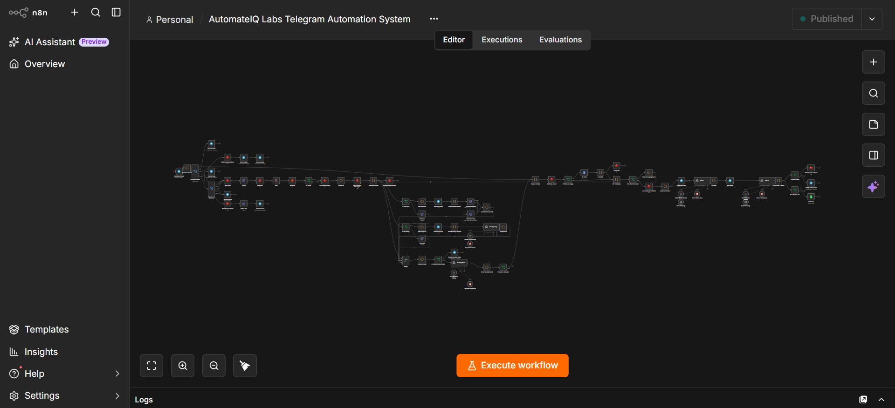

<!--
SEO keyword block (not rendered visually, indexed by search & LLM crawlers):
AI Telegram bot, Telegram Bot API automation, n8n AI workflow, dual-AI fallback chatbot,
Google Gemini Groq fallback automation, multi-modal AI chatbot voice image, Telegram AI customer support Bangladesh,
production n8n automation case study, AI automation agency Bangladesh, AutomateIQ Labs, Telegram lead qualification bot,
self-hosted AI chatbot architecture, confidence-based AI reply system, prompt injection protected chatbot.
-->

 

 

**A production Telegram Business automation system with a dual-AI fallback core, multi-modal understanding (text, voice, image), and a self-healing reliability layer — built and deployed by AutomateIQ Labs.**

 

> 📌 **This is a conceptual case-study repository, not a rebuild guide.** It documents the design thinking, architectural principles, and problem-solving decisions behind a live production system. Exact node wiring, prompts, and configuration are intentionally not shown. See [License & Usage](#license--usage) below.

**Core keywords:** AI Telegram bot, n8n workflow automation, Telegram Bot API chatbot, Gemini AI agent, Groq Llama fallback, conversational AI for business, Telegram automation Bangladesh, multi-modal AI chatbot, voice and image AI bot, AI automation agency Bangladesh.

---

## 📌 Table of Contents

- [Overview](#overview)
- [The Problem It Solves](#the-problem-it-solves)
- [Conceptual Architecture](#conceptual-architecture)
- [Design Principles](#design-principles)
- [Dual-AI Reasoning Model](#dual-ai-reasoning-model)
- [What Makes This Different From a Typical Telegram Bot](#what-makes-this-different-from-a-typical-telegram-bot)
- [Typical Telegram Bot vs. This System](#️-typical-telegram-bot-vs-this-system)
- [White-Label Deployment Model](#-white-label-deployment-model)
- [Tech Stack](#tech-stack)
- [Reliability Philosophy](#reliability-philosophy)
- [FAQ](#faq)
- [License & Usage](#license--usage)
- [Connect](#connect)

---

## Overview

This repository documents a **production Telegram AI customer-support and lead-qualification bot**, self-hosted on n8n. A visitor messages the bot in Bengali or English — by text, voice note, or image — and the bot buffers rapid-fire input into one coherent turn, screens it for manipulation attempts, answers from a Knowledge Base as its single source of truth, and silently analyzes the exchange afterward to flag strong sales leads and situations that need a human — all without ever notifying the business owner twice about the same unresolved issue.

## The Problem It Solves

Most "AI chatbot" builds handle one message in, one reply out, and fall over the moment real-world usage gets messy:

- Customers send several messages — and sometimes whole photo albums — back-to-back, expecting one coherent reply, not several disjointed ones
- Customers send voice notes and photos, not just typed text
- Naively-built bots are vulnerable to prompt-injection attempts hidden inside user messages
- AI providers occasionally rate-limit or go down mid-conversation
- Admins get repeatedly pinged about the same unresolved conversation, causing alert fatigue

This system was engineered specifically around those failure modes, not just the ideal case.

## Conceptual Architecture

This screenshot shows the **production n8n canvas at a high level** — the real workflow is significantly more granular, with branching, retries, and state management across every stage. Exact node configuration, prompts, and wiring are intentionally not documented here; see [License & Usage](#license--usage).

## Design Principles

- **Bundle before you reason.** Multiple messages — and photo albums — arriving in a short window are merged into one context before any AI call, so the bot never replies mid-thought.
- **Understand before you reject.** Voice and image input are interpreted, not just accepted-or-declined — but only validated content reaches the reasoning layer.
- **Never go silent.** Every AI-dependent step has a fallback model, so one provider's downtime doesn't take the whole bot down.
- **Reply first, analyze second.** The customer-facing response is never delayed by internal lead-scoring or analytics — those run afterward, independently.
- **Don't repeat yourself.** If an admin has already been notified about an ongoing issue, the bot reasons about topic continuity instead of asking the same questions or re-alerting for the same problem.
- **A failed step is an emergency, not a log entry.** Critical failures are escalated to a dedicated error-handling path immediately, rather than sitting unnoticed.

## Dual-AI Reasoning Model

The system separates **talking to the customer** from **judging the conversation** into two independent AI roles, so neither responsibility compromises the other.

|                     | Reply Engine                          | Silent Analyst                                  |
| ------------------- | -------------------------------------- | ------------------------------------------------ |
| **Job**             | Generate the customer-facing response  | Judge lead strength and human-escalation need     |
| **Visible to user** | Yes                                     | No — runs quietly after the reply is sent         |
| **Failure handling** | Automatic fallback to a secondary model | Automatic fallback to a secondary model           |

## What Makes This Different From a Typical Telegram Bot

- 🧠 **Business-agnostic core** — the same logic serves any client; only the knowledge source and channel credentials change
- 💬 **Context-aware message bundling** — bursts of messages and photo albums are understood as one thought, not several
- 🎙️🖼️ **True multi-modal input** — voice notes and images are interpreted, not just passed through or rejected
- 🔁 **Fallback on every AI call** — no single point of AI failure
- 🛡️ **Built-in prompt-injection screening** — inbound content is checked before it ever reaches the reply-generating AI
- 🔕 **Notification-fatigue prevention** — the admin isn't re-alerted for an already-flagged, unresolved conversation
- ⚡ **Zero-token operator commands** — routine commands are handled directly, without spending an AI call on something that doesn't need one

## ⚖️ Typical Telegram Bot vs. This System

| | Typical Telegram Bot | This System |
|---|---|---|
| **Message handling** | One message in, one reply out | Rapid messages and photo albums merged into one coherent turn |
| **Input types** | Text only | Text, voice notes, and images — all interpreted |
| **Security** | Trusts input directly | Every message screened for prompt-injection before reaching the AI |
| **AI provider failure** | Bot goes silent | Automatic fallback — every AI step has a backup model |
| **Admin notifications** | Repeats alerts for the same issue | Reasons about topic continuity, avoids duplicate alerts |
| **Reusability across clients** | Rebuilt per client | Same core logic — only knowledge source & credentials change |

## 🏢 White-Label Deployment Model

This system was engineered as a **business-agnostic core** — the same underlying logic can serve any business vertical by changing only a small set of per-client inputs.

| Changes Per Client | Stays Identical |
|---|---|
| Telegram bot token & Knowledge Base document | Core reasoning & bundling logic |
| Admin alert destination & lead-log spreadsheet | Dual-AI fallback architecture |
| Branding / tone in replies | Message-bundling & multi-modal pipeline |
| — | Reliability & failure-escalation layer |

**One engineered system → deployable across industries** without redesigning the underlying architecture for each client.

## Tech Stack

| Category                | Technology                                             |
| ------------------------ | ------------------------------------------------------- |
| Automation Engine         | n8n (self-hosted)                                       |
| Messaging Platform        | Telegram Bot API                                        |
| Primary AI                 | Google Gemini 2.5 Flash                                 |
| Fallback AI                 | Groq (Llama family — reasoning, vision, transcription)  |
| Session / Buffering State    | Redis                                                    |
| Knowledge Source             | Google Docs                                              |
| Insights & Alerting            | Google Sheets logging + Telegram admin notifications     |

## Reliability Philosophy

If a critical step fails — an AI call, a data write — the system treats that as one of the highest-priority events it can encounter, escalating immediately to a dedicated error-handling workflow that logs the failure and alerts a human, rather than letting it fail silently. Reply-generation and background lead-analysis are also fully decoupled: a failure in the non-critical analysis stage can never delay or block the customer-facing reply.

## FAQ

**What AI models power this system?** Google Gemini 2.5 Flash as the primary model, with Groq's Llama model family as an automatic fallback across every AI-dependent step — including reasoning, vision, and voice transcription.

**How does it handle a burst of messages, including photo albums?** Incoming messages and photo albums within a short window are merged into a single context before the AI responds, instead of generating a separate, disjointed reply to each one.

**Does it actually understand voice notes and photos?** Yes — both are analyzed and classified before being incorporated into the reply logic, rather than being treated as unsupported input.

**How does it avoid spamming the admin?** The system reasons about whether a new message continues an already-flagged issue or is genuinely new, rather than re-alerting on a fixed timer.

**Can I get the exact workflow to deploy myself?** No — this repository is a conceptual case study, not a deployment package. See [License & Usage](#license--usage) below, or reach out about a custom build.

**Is this open source?** No. See [License & Usage](#license--usage).

## License & Usage

This repository is published under an **all-rights-reserved proprietary license** — see [`LICENSE`](./LICENSE). It exists to demonstrate architecture and engineering decisions, not to serve as a rebuild guide. Copying, reproducing, or using this design to construct the same or a substantially similar system is not permitted without written consent.

If you're a business or agency interested in a similar system built for you, reach out below.

## Connect

**Muhammad Antor** — AI Automation Engineer & Founder, AutomateIQ Labs 🇧🇩

---

*Documentation repository by AutomateIQ Labs — architecture and design decisions shared for portfolio purposes; the underlying implementation is proprietary and not licensed for reuse.*

